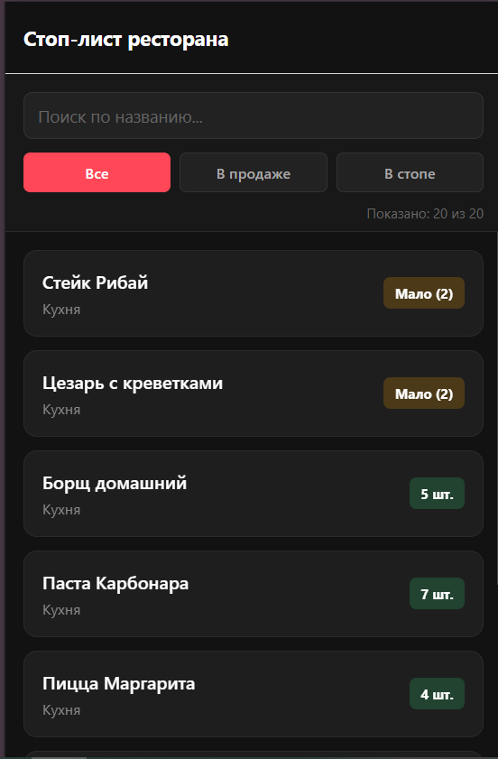
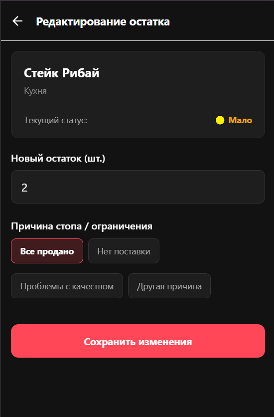
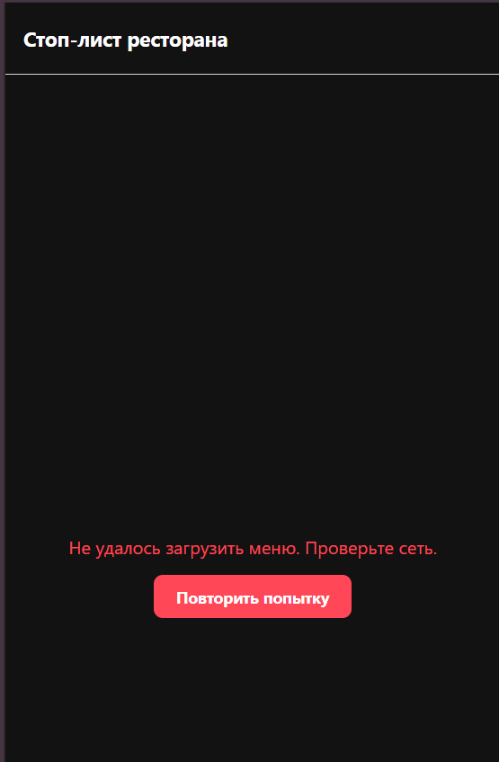

# 📱 Coperto Stop-List


Мобильное приложение для управления стоп-листом ресторана.

Приложение позволяет менеджеру быстро просматривать блюда, отслеживать их остатки, искать позиции, фильтровать список по статусу и изменять доступное количество с указанием причины остановки.

Проект выполнен на **React Native + Expo + TypeScript**.

---

## ✨ Возможности

* 📋 Просмотр списка блюд и их текущих остатков
* 🔎 Поиск блюд по названию
* 🏷 Фильтрация по статусу
* ✏️ Редактирование количества доступных порций
* ⛔ Указание причины добавления позиции в стоп-лист
* ✅ Валидация введённого количества
* 🔄 Автоматическое обновление списка после редактирования
* ⚠️ Обработка ошибок загрузки данных
* 📱 Поддержка мобильного интерфейса и Web через Expo

---

## 🎥 Демонстрация

Небольшое видео с демонстрацией основных сценариев приложения:

**[▶ Смотреть демонстрацию](docs/unknown_2026.09.12-11.48_1.mp4)**

---

## 🖥 Скриншоты

### Все экраны

|          Главный экран          |          Редактирование          |      Ошибка загрузки      |
| :-----------------------------: | :------------------------------: | :-----------------------: |
|  |  |  |

> Если скриншотов станет больше, их можно организовать в отдельную директорию `docs/screens/`.

---

## 🛠 Технологии

* **React Native**
* **Expo**
* **TypeScript**
* **React Navigation**
* **React Hooks**
* **Expo Web**

---

## 📁 Структура проекта

```text
src/
├── api/              # Работа с API
├── components/       # Переиспользуемые UI-компоненты
├── hooks/            # Кастомные React Hooks
├── lib/              # Бизнес-логика и вспомогательные функции
├── screens/          # Экраны приложения
└── ...
```

Основная бизнес-логика вынесена отдельно от UI. Например, функции расчёта статусов и обработки остатков находятся в `lib/`, что позволяет использовать и тестировать их независимо от компонентов.


---

## 🚀 Запуск проекта

### 1. Клонирование

```bash
git clone 
cd CopertoStopList
```

### 2. Установка зависимостей

```bash
npm install
```

### 3. Запуск Expo

```bash
npx expo start
```

После запуска Expo можно выбрать нужную платформу:

* **Android** — через Expo Go или Android Emulator
* **iOS** — через Expo Go или iOS Simulator
* **Web** — в браузере

Для запуска Web:

```bash
npx expo start --web
```

---

## 🧩 Архитектура

Приложение разделено на несколько логических уровней.

### API

Отвечает за получение и изменение данных.

### Hooks

Кастомные хуки инкапсулируют работу с состоянием, загрузкой и ошибками.

### Lib

Содержит независимую бизнес-логику: обработку остатков, определение статусов и валидацию данных.

### Screens

Отвечают за отдельные экраны приложения.

### Components

Содержат переиспользуемые UI-компоненты.

Такое разделение позволяет не смешивать бизнес-логику с отображением интерфейса и упрощает дальнейшее развитие проекта.

---

## 🏠 Главный экран

Главный экран отвечает за отображение списка блюд и взаимодействие пользователя с ним.

Основные задачи экрана:

* загрузка списка;
* поиск;
* фильтрация;
* отображение состояний загрузки;
* отображение ошибок;
* переход к редактированию;
* обновление данных.

### Планируемое улучшение

По мере роста проекта логику и UI главного экрана целесообразно разделить на независимые компоненты.

Например:

```text
HomeScreen
│
├── SearchBar
├── FilterBar
├── MenuList
│   └── MenuItemCard
│       ├── StatusBadge
│       └── StockInfo
├── LoadingState
├── EmptyState
└── ErrorState
```

В результате `HomeScreen` будет отвечать преимущественно за состояние и композицию, а отдельные компоненты — за конкретные части интерфейса.

---

## ✏️ Редактирование

Экран редактирования позволяет изменить количество доступных порций и указать причину изменения.

Перед сохранением выполняется валидация введённых данных.

---

## ✅ Валидация

Для количества доступных порций используются следующие ограничения:

* значение должно быть целым числом;
* допустимый диапазон — `0–999`;
* запрещены некорректные значения и ведущие нули;
* при установке стоп-листа необходимо выбрать причину.

Ошибки отображаются непосредственно в форме, без использования `Alert`.

---

## 🔄 Работа с данными

В текущей версии проекта используется API-слой с моковыми данными.

При изменении блюда данные обновляются, а при возвращении на главный экран список синхронизируется с актуальным состоянием.

Это позволяет имитировать работу приложения с реальным backend API без изменения структуры компонентов.

---

## Дальнейшее развитие

При дальнейшем развитии проекта можно реализовать:

* подключение полноценного backend API;
* авторизацию пользователей;
* роли сотрудников и менеджеров;
* разделение главного экрана на независимые UI-компоненты;
* использование **TanStack Query** для кэширования и синхронизации;
* использование **Zustand** или **Redux Toolkit** при необходимости глобального состояния;
* добавление unit-тестов для бизнес-логики;
* push-уведомления об изменении стоп-листа;
* улучшение offline-режима и обработки сетевых ошибок.

---

## 📌 Статус проекта

**Pet / Test Project**

Проект создан для демонстрации навыков разработки мобильных интерфейсов на **React Native**, работы с **TypeScript**, навигацией, состоянием приложения, валидацией форм и разделением бизнес-логики и UI.

---

## 👨‍💻 Автор

**Илья Таниди**

Junior–Middle Web Developer

```text
React • TypeScript • JavaScript • React Native • Expo
```

---

## 📄 Лицензия

Проект создан в учебных и демонстрационных целях.
